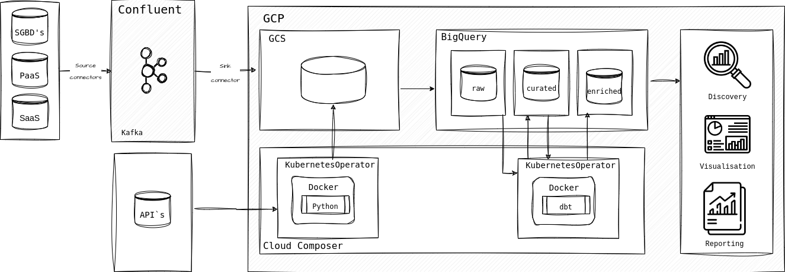

### Intro

Este repositório contém a proposta de uma arquitetura para a criação de um Data Lake. 
O desenho contempla um cenário hipótetico onde os dados teriam 
origens diversas e deveriam ser disponibilizados no ambiente analítico 
para que os times de analystics e data science possam utilizá-los.

### Estrutura do repositório
- ````architecture.drawio````
- ````architecture.drawio.png````

### Arquitetura


- aquisição dos dados
    - de SGBD`s via CDC com Debezium, conector do Kafka Connect
    - de SaaS como Hubspot, Salesforce e Zendesk via Kafka connectors específicos
    - de API`s diversas através de consumidor escritos em Python
- armazenamento dos dados
    - Cloud Storage para armazenamento de dados estruturados e não estruturados
- tratamento dos dados
    - tratamento de dados via dbt sendo orquestrados pelo Airflow
- disponibilização dos dados
    - dados disponibilizados no BigQuery em arquitetura medallion: camadas bronce, silver e gold para análise
    - dados do Cloud Storage disponíveis para modelos de Data Science

### Pontos fortes
- Kafka Connect permite extração em streaming de diversos bases de dados transacionais.
- Processamento de dados escalável e barato devido a engine ser baseada em BigQuery.
- ELT: transformação depois da carga permite facilmente a reexecução das transformações de dados. 
- DBT: Integra transformação com documentação e testes de qualidade sobre os dados.

### Pontos fracos
- A necessidade de Cloud Storage pode ser questionada: dados estruturados ou semi-estruturados 
poderiam ser ingeridos diretamente na camada raw do BigQuery
- Transformação do dados somente em batch, o que pode ser limitador para alguns produtos de dados. 
Se necessário streaming, teria que ser adicionado um novo componente que permitisse isso na arquitetura.